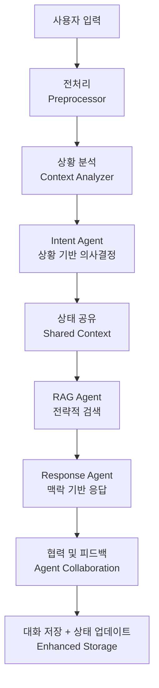
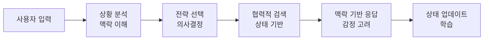
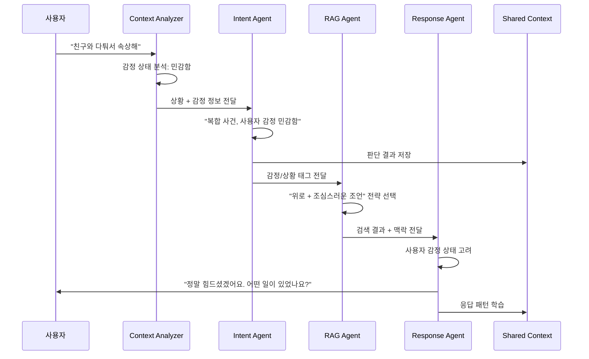
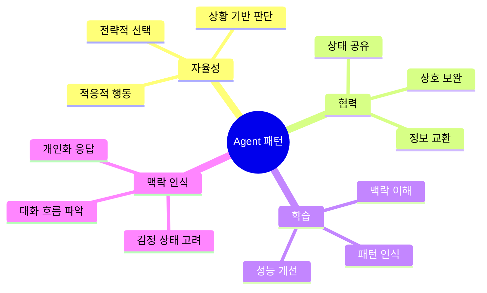

# Agent 패턴 파이프라인

## 개선된 챗봇 시스템의 처리 흐름

## Agent 패턴의 개선점

## Agent 간 협력 예시

## Agent 패턴의 장점

## Agent 패턴의 핵심 특징

1. **자율성**: 각 Agent가 상황을 분석하고 최적의 행동을 선택
2. **상태 관리**: Agent들이 자신의 상태와 다른 Agent의 상태를 공유
3. **협력**: Agent들이 서로의 판단을 참고하여 더 정확한 결과 도출
4. **적응성**: 상황에 따라 다른 전략을 사용
5. **학습**: 대화 패턴을 학습하여 점진적으로 개선

## 처리 예시 비교

| 구분 | 현재 시스템 | Agent 패턴 |
|------|------------|------------|
| **입력** | "친구와 다퉈서 속상해" | "친구와 다퉈서 속상해" |
| **분류** | 단순 감정 표현 | 복합 사건 + 감정 민감함 |
| **검색** | 실행 안됨 | 위로 + 조심스러운 조언 |
| **응답** | "힘드셨겠어요" | "정말 힘드셨겠어요. 어떤 일이 있었나요?" |
| **결과** | 표면적인 위로 | 공감 + 구체적 질문 | 