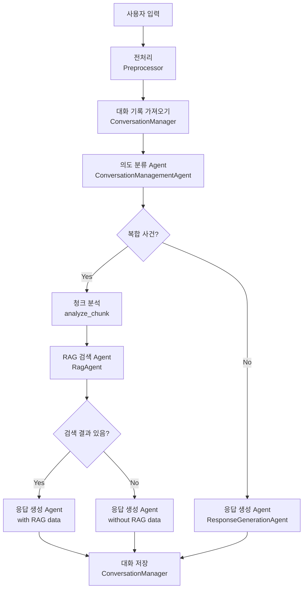
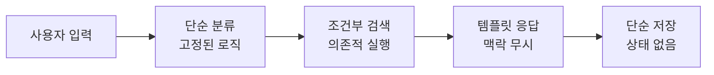
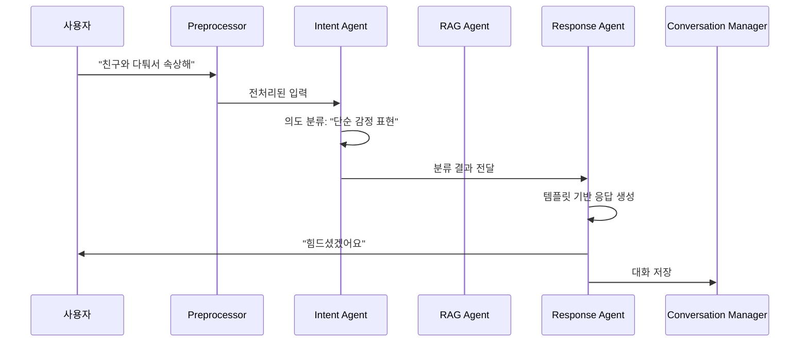

# 현재 시스템 파이프라인

## 현재 챗봇 시스템의 처리 흐름

## 현재 시스템의 문제점

## 현재 시스템의 처리 예시

## 현재 시스템의 한계

1. **단순한 분류**: 복잡한 상황을 단순하게 분류
2. **독립적 실행**: 각 Agent가 서로의 판단을 참고하지 않음
3. **상태 없음**: 이전 대화의 맥락을 제대로 활용하지 못함
4. **고정된 로직**: 상황에 따른 유연한 대응 불가
5. **맥락 무시**: 사용자의 감정 상태나 상황을 고려하지 않음 